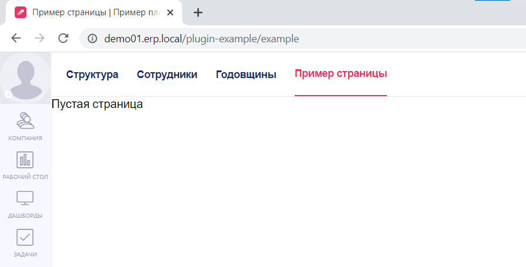
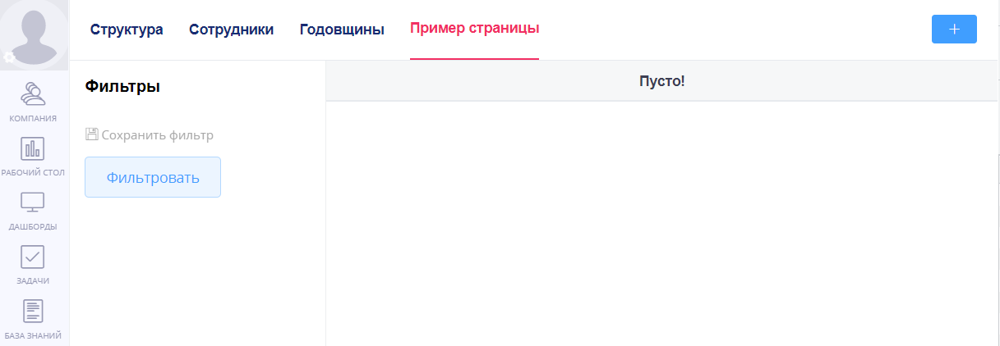
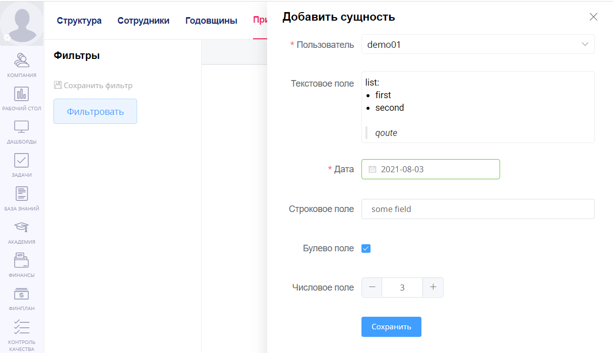
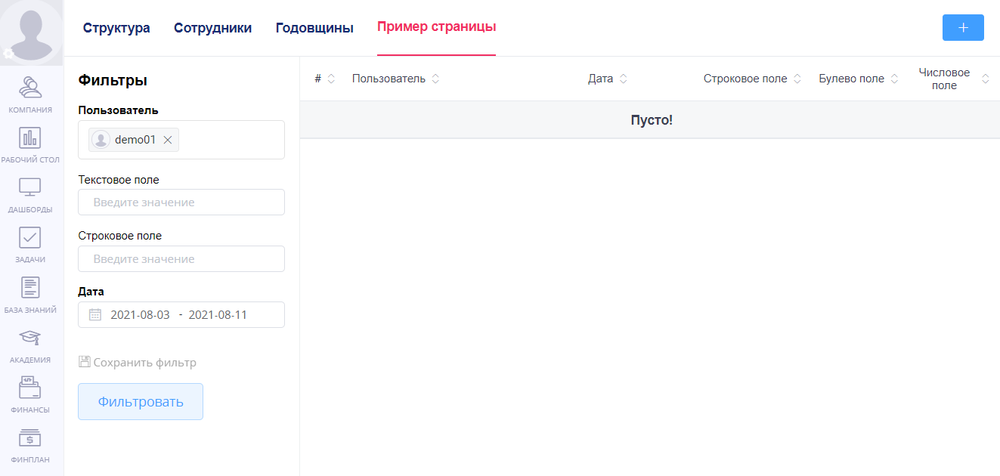
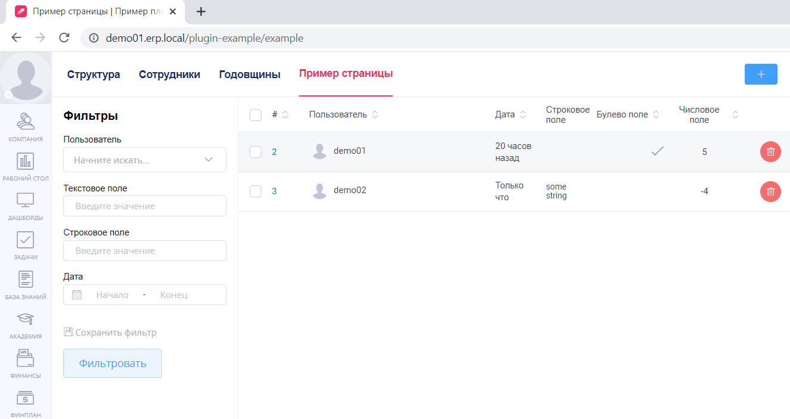

# Инструкция по созданию плагина

Данная инструкция поможет вам научиться создавать плагины в `Platrum`.

Для работы с плагинами вам потребуется:

* Знакомство со стандартом ECMAScript 2015
* Знание фреймворка [vue](https://vuejs.org/)
* базовое понимание формата [yml](https://ru.wikipedia.org/wiki/YAML)

После её прочтения вы:

* [Научитесь устанавливать плагины в проект](#установка)
* [Узнаете об устройстве плагинов](#общая-структура-плагина)
* [Создадите свой первый плагин](#создание-плагина)


## Установка

Управление плагинами осуществляется на странице настроек `/settings/page/plugins/list`.
Для доступа к этой странице в проекте вам необходимо обладать правами `Администрирование плагинов` (обратитесь к администратору проекта в случае отсутствия доступа).

Во время разработки плагина для проверки промежуточного результата работы неудобно каждый раз обращаться к веб-интерфейсу для загрузки текущей версии плагина.
Вместо интерфейса вы можете воспользоваться скриптом загрузки `upload.sh`, который располагается в корне этого репозитория.
Для работы скрипта вам потребуется установить следующие переменные окружения:

* `PLATRUM_API_KEY` - апи ключ вашего проекта
* `PLATRUM_API_PROJECT` - хост вашего проекта

### Подготовка к установке для windows:
1. Установить wsl 2. Это необходимо, чтобы вы могли удобно работать с linux прямо из windows. Установка происходит легко и быстро. Если ранее вы не имели опыта работа с linux, рекомендуем вам следовать [инструкциям по установку с сайта Microsoft](https://learn.microsoft.com/ru-ru/windows/wsl/install)
Для установки введите в терминале:
```
wsl --install
```
2. После установки wsl2 и дистрибутива linux последующую работу нужно выполнять из терминала установленного вами дистрибутива.

### Установка на linux/mac:
1. Установите архиватор.
```
sudo apt install zip
```
2. Далее необходимо установить docker для того, чтобы сборка приложения происходила корректно. [Пошагавая инструкция по установке docker находится здесь](https://www.digitalocean.com/community/tutorials/how-to-install-and-use-docker-on-ubuntu-20-04#step-1-installing-docker)

3. Склонируйте репозиторий, перейдите в его директорию.
```
git clone https://github.com/platrum/plugin-example
cd plugin-example
```
4. Войдите в режим суперпользователя. Он необходим далее, чтобы сборка плагина прошла успешно. 
```
sudo bash
```
5. Настройте переменные окружения. В команды ниже вставьте api ключ вашего проетка вместо 'api-key' и хост вашего проекта вместо 'host'.
```
export PLATRUM_API_KEY='api-key'
export PLATRUM_API_PROJECT='host'
```
6. Запустите сборку приложения из режима суперпользователя (администратора)

```
./upload.sh example
```

Плагин можно добавить в модуль, где доступна верхняя панель навигации. Для этого необходимо в файл плагина `app.js` добавить следующие настройки:

```
export default {
  slots: {
    'page.layout.navbar.finance': [
      {
        name: 'Пример страницы',
        route: 'plugin-example.examplePage',
      },
    ],
  },
};
```

## Общая структура плагина

Плагин имеет простую структуру: он состоит из файлов конфигурации и файлов фронтенда, которые находятся в корневых папках `config` и `frontend` соответственно.
Далее мы познакомимся с [файлами конфигурации](#файлы-конфигурации) и узнаем о том, как устроен [frontend](#frontend).

### Файлы конфигурации

Для гибкой настройки разных аспектов вашего приложения, плагины используют файлы конфигурации. 
Рассмотрим список доступных файлов:

* `main.yml` - **обязательный** [базовый файл конфигурации](#базовая-конфигурация)
* `routes.yml` - [список маршрутов](#маршруты)
* `schema.yml` - [схема данных](#схема-данных)
* `access.yml` - [определение доступов](#доступы)
* `translations.yml` - [переводы](#переводы)

#### Базовая конфигурация

Для того чтобы ваш плагин заработал, необходимо добавить базовый файл конфигурации `config/main.yml`.
В этом файле определяются системное и человекочитамое имена плагина, краткое описание функциональности, а так же перечисляются зависимости от модулей `Platurm`:

```yml
module: plugin-example
name: Пример плагина
description: Описание плагина
dependencies:
  - ui
  - ui-collection
  - ui-element
  - company
```

Где:

* `module` - системное название плагина (наличие `plugin-` префикса **обязательно**)
* `name` - человекочитаемое имя плагина
* `description` - краткое описание функциональности плагина
* `dependencies` - перечисление зависимостей плагина от системных модулей `Platrum`

Список доступных модулей для `dependencies`:

* `ui`, `ui-collection` - модуль, предоставляющие стандартную библиотеку ui компонентов `Platrum`
* `ui-element` - модуль, предоставляющий библиотеку компонентов ui-element
* `utils` - модуль, предоставляющий базовые утилиты
* `lists` - модуль для работы со списками
* `user` - модуль для работы с профилями пользователей
* `company` - модуль компании
* `finance` - модуль финансов
* `finplan` - модуль фин. планирования
* `notification` - модуль уведомлений
* `orgschema` - модуль оргсхемы
* `password` - модуль паролей
* `quality` - модуль контроля качества
* `settings` - модуль настроек
* `store` - модуль склада
* `tasks` - модуль задач
* `wiki` - модуль базы знаний
* `workdesk` - модуль рабочего стола

#### Маршруты

В файле `config/routes.yml` определяются маршруты вашего frontend приложения.
Маршрут - это то, что сопоставляет путь до страницы и frontend компонент страницы. 
Без добавления маршрутов в этот файл страницы вашего приложения не будут доступны.
Пример конфигурации frontend маршрутов:

```yml
frontend:
  examplePage:
    pattern: /example
    title: Example page
  examplePage2:
    pattern: /example2
    title: Example page 2
```

Где:

* `frontend` - ключевое слово. Объявляемые маршруты должны располагаться на уровень ниже, как в примере
* `examplePage` - id страницы, используемый для сопоставления пути и компонента страницы
* `pattern` - путь до страницы, отображаемый в адресной строке браузера
* `title` - заголовок страницы, отображаемый во вкладке браузера

#### Схема данных

Для работы с данными вам необходимо описать сущность, с которой вы собираетесь работать, в файле `config/schema.yml`.
Возможности для манипулирования данными мы рассмотрим позднее.
Ниже приведен пример добавления сущности `example_item` с набором полей `fields`:

```yml
example_item:
  fields:
    user_id:
      type: string
    text:
      type: string
    date:
      type: date
    string_field:
      type: string
    bool_field:
      type: bool
    int_field:
      type: int
    map_field:
      type: map
```

Доступные типы полей:

* `int` - целочисленное значение
* `string` - строковое значение
* `bool` - булево значение
* `array` - массив значений
* `map` - коллекция ключ/значение
* `date` - дата в `ISO` формате

#### Доступы

Платформа позволяет проверять пользовательские доступы.
Для работы с доступами вам потребуется описать их в файле `config/access.yml`:
Пример добавления доступа:

```yml
user_creation:
  name: Создание пользователей
user_deletion:
  name: Удаление пользователей
```

Где:

* `user_creation` - системное название доступа, которому вы будете обращаться при проверке доступа
* `Создание пользователей` - человекочитаемое название доступа

После объявления доступа, он появится на странице доступов `/settings/page/common/access`.

#### Переводы

Платформа позволяет быть вашему плагину мультиязычным. Переводы хранятся в файле `config/translations.yml`.
Также в этом файле объявляется имя вашего плагина, показываемое пользователям.
Пример:

```yml
ru:
  module.name: Пример плагина
en:
  module.name: Plugin example
  Выберите пользователя: Select user
  Заполните дату: Fill in the date
```

Где:

* `ru` - код языка. На данный момент доступно три языка: `ru`, `en`, `cn`
* `module.name` - имя вашего плагина
* `Выберите пользователя: Select user` - фраза и её перевод

Для перевода фразы, достаточно использовать глобально зарегистрированную функцию `t`.
Пример использования функции `t` во `vue` компоненте:

```vue
<template>
  <div>{{ t('Выберите пользователя') }}</div>
</template>
```

### Frontend

Для разработки frontend'а используется фреймворк `vue` версии `2.5`.

Так же вам доступна библиотека компонентов [element](https://element.eleme.io/2.9/#/en-US) версии `2.9`.
Для использования библиотеки вам потребуется добавить модуль `ui-element` в `dependencies` в базовом файле конфигурации `config/main.yml`. 

Далее рассмотрим базовые frontend файлы:

#### app.js

В этом файле вы можете определить функцию `initHook`, которая будет вызываться при каждой загрузке страницы проекта.
Так же этот файл позволяет вам расширять функциональность модулей `Platrum`, добавляя свои страницы (более подробно мы рассмотрим этот механизм позже):

```js
export default {
  initHook($platform) {
    console.log('init plugin');
  },
  slots: {
    'company.header': [
      {
        name: 'Пример страницы',
        route: 'plugin-example.examplePage',
      },
    ],
  },
};
```

#### pages.js

Этот файл служит для экспортирования страниц приложения. Пример экспортирования:

```js
import examplePage from './pages/examplePage';

export default {
  examplePage,
};
```

Обратите внимание: экспортируемое название должно совпадать с id маршрута, который должен сопоставляться странице.
Для страницы `examplePage` правильное определение маршрута выглядит так:

```yml
frontend:
  examplePage: # id маршрута
    pattern: /example 
    title: Example page
```

## Создание плагина

В данном разделе мы пошагово создадим с вами базовый плагин, который вы сможете использовать для дальнейшей разработки под собственные нужды.
Что мы сделаем в рамках данного руководства:

* [Добавим пустую страницу в меню `компании`](#Добавление-пустой-страницы-в-меню-модуля)
* [Оживим страницу, добавив в неё верстку](#Добавляем-верстку-на-страницу)
* [Сконфигурируем фильтры и колонки таблицы](#Конфигурация-страницы)
* [Научимся управлять доступами](#Контролируем-доступы)
* [Узнаем, как манипулировать данными](#Управляем-данными)

### Добавление пустой страницы в меню модуля

На данном шаге мы создадим хоть и пустую, но работающую страницу в проекте. 
Для добавления страницы в меню `компании` нам нужно:

* [создать `vue` компонент страницы](#Создание-компонента-страницы)
* [экспортировать страницу в `frontend/pages.js`](#Экспортируем-страницу)
* [объявить маршрут в `config/routes.yml`](#Добавляем-маршрут-страницы)
* [добавить имя модуля в `config/translactions.yml`](#Добавляем-название-плагина)
* [добавить созданную страницу в меню модуля `компании`](#Добавление-страницы-в-меню-модуля)

#### Создание компонента страницы

Создадим пока что пустую страницу в папке `frontend/pages/examplePage/index.vue`.
При разработке плагина вы можете придерживаться любой удобной вам структуры файлов, единственное ограничение - все ваши компоненты должны находится в корневой папке плагина `frontend`.

```vue
<template>
  <company-layout>
    <div>Пустая страница</div>
  </company-layout>
</template>
```

Здесь `company-layout` - это компонент-разметка, необходимый нам для добавления на страницу меню модуля.
Без него на нашей странице отсутствовало бы меню `компании`. 

#### Экспортируем страницу

```js
import examplePage from './pages/examplePage';

export default {
  examplePage,
};
```

#### Добавляем маршрут страницы

```yaml
frontend:
  examplePage:
    pattern: /example
    title: Пример страницы
```

#### Добавляем название плагина

Для того чтобы во вкладке браузера отображалось название нашего модуля, определим имя модуля `module.name` в `config/translactions.yml`:

```yaml
ru:
  module.name: Пример плагина
en:
  module.name: Plugin example
```

#### Добавление страницы в меню модуля

Модули платформы, например модуль `компании`, поддерживают добавление страниц плагинов в своё меню.
Чтобы добавить страницу в меню модуля, нам потребуется объявить свойство `slots` в экспортируемом по умолчанию объекте в `frontend/app.js`

```js
export default {
  slots: {
    'company.header': [
      {
        name: 'Пример страницы',
        route: 'plugin-example.examplePage',
      },
    ],
  },
};
```

Где:

* `company.header` - системное название слота меню
* `name` - заголовок вкладки меню
* `route` - id маршрута страницы, который мы добавили ранее. Обратите внимание на то, что к id маршрута нужно добавлять имя вашего модуля, указанное в `config/main.yml` в ключе `module`.  

#### Результат

Загружаем наш промежуточный результат, используя скрипт `upload.sh`:

```bash
./upload.sh example
```

В следующих разделах не будет упоминаться использование команды выше, но имейте в виду - для того, чтобы ваши изменения применились, вам необходимо повторно загружать код плагина.

После загрузки плагина, нам станет доступна страница по пути `/plugin-example/example`:

<p align="center">
  
</p>

### Добавляем верстку на страницу

На прошлом шаге мы создали с вами пусть и открывающуюся, но не очень полезную страницу.
В этом шаге мы оживим эту страницу, добавив:

* [базовую верстку с таблицей и панелью фильтров](#Базовая-верстка)
* [сайдбар с формой для заполнения данных](#Добавление-сайдбара-с-формой)

#### Базовая верстка

Добавим базовую верстку на ранее созданную страницу `frontend/pages/examplePage/index.vue`.
На этой странице мы уже добавили компонент-разметку `company-layout`.
Этот компонент предоставляет следующие [слоты](https://ru.vuejs.org/v2/guide/components-slots.html) для разметки:

* Слот `toolbar` позволяет добавлять разметку в верхнее меню модуля. В него мы добавим кнопку для открытия сайдбара.
* Слот `sidebar` позволяет добавлять разметку в левую часть страницы. В этом примере мы добавим в него панель с фильтрами.
* Слот по умолчанию, в котором размещается основной контент страницы, в нашем примере это будет таблица и сайдбар с формой для заполнения данных.

В разметке мы будем использовать компоненты предоставляемые библиотеками `ui-element` и `ui-collection`:

```vue
<template>
  <company-layout>
    <div slot="toolbar">
      <el-button
        type="primary"
        size="mini"
        icon="el-icon-plus"
      />
    </div>

    <ui-collection-panel-filter
      slot="sidebar"
      v-model="filter"
      :settings="filterSettings"
    />

    <ui-collection-panel-table
      v-loading="isLoading"
      :columns="columns"
      :rows="entities"
      clickable
      empty-text="Пусто!"
      selectable
      without-settings
    />
  </company-layout>
</template>

<script>
export default {
  data() {
    return {
      isLoading: false,
      filter: {},
      filterSettings: [],
      columns: [],
      entities: [],
    }
  },
};
</script>
```

Здесь мы добавили:

* `el-button` кнопку в слот `toolbar`
* панель с фильтрами `ui-collection-panel-filter` в слот `sidebar`
* таблицу `ui-collection-panel-table` в слот по умолчанию.

Вот, что у нас поучилось:

<p align="center">
  
</p>

#### Добавление сайдбара с формой

Добавим сайдбар с формой для заполнения данных:

```vue
<template>
  <ui-sidebar
    v-model="isSidebarVisible"
    title="Добавить сущность"
    class="sidebar"
    @hide="resetState"
  >
    <el-form class="content" ref="form" :model="item" label-width="150px">
      <el-form-item
        label="Пользователь"
        prop="user_id"
        :rules="[{ required: true, message: 'Выберите пользователя'}]"
      >
        <orgschema-user-selector v-model="item.user_id" :font-size="14" />
      </el-form-item>

      <el-form-item label="Текстовое поле" prop="text">
        <ui-text-editor v-model="item.text" class="text-editor" bordered />
      </el-form-item>

      <el-form-item
        prop="date"
        label="Дата"
        :rules="[{ required: true, message: 'Заполните дату'}]"
      >
        <el-date-picker
          v-model="item.date"
          type="date"
          placeholder="Заполните дату"
          size="small"
        />
      </el-form-item>

      <el-form-item label="Строковое поле" prop="string_field">
        <el-input v-model="item.string_field" size="small" />
      </el-form-item>

      <el-form-item label="Булево поле" prop="bool_field">
        <el-checkbox v-model="item.bool_field" />
      </el-form-item>

      <el-form-item label="Числовое поле" prop="int_field">
        <el-input-number v-model="item.int_field" size="small" />
      </el-form-item>

      <el-form-item>
        <el-button
          type="primary"
          size="small"
          @click="submit"
        >
          <span>Сохранить</span>
        </el-button>
      </el-form-item>
    </el-form>
  </ui-sidebar>
</template>

<script>
export default {
  props: {
    value: Object,
  },
  data() {
    return {
      isSidebarVisible: false,
      item: {},
    };
  },
  watch: {
    value: {
      immediate: true,
      handler(val) {
        this.item = $utils.object.clone(val);
      },
    },
  },
  methods: {
    open() {
      this.isSidebarVisible = true;
    },
    async submit() {
      try {
        await this.$refs.form.validate();
      } catch (e) {
        this.$uiNotify.error('Заполните необходимые поля');
        return;
      }
      this.$emit('input', this.item);
      this.resetState();
    },
    resetState() {
      this.isSidebarVisible = false;
      this.$emit('hide');
    },
  },
};
</script>

<style lang="less" scoped>
.sidebar {
  top: 0 !important;
  width: 550px;
  background: white;

  .content {
    padding-right: 30px;

    .text-editor {
      line-height: 20px;
    }
  }
}
</style>
```

Доработаем страницу `frontend/pages/examplePage/index.vue` для того, чтобы мы могли открыть сайдбар по нажатию на кнопку `+`, расположенную в верхнем правом углу страницы:

```vue
<template>
  <company-layout>
    <div slot="toolbar">
      <el-button
        type="primary"
        size="mini"
        icon="el-icon-plus"
        @click="openSidebar"
      />
    </div>

    <ui-collection-panel-filter
      slot="sidebar"
      v-model="filter"
      :settings="filterSettings"
    />

    <ui-collection-panel-table
      v-loading="isLoading"
      :columns="columns"
      :rows="entities"
      clickable
      empty-text="Пусто!"
      selectable
      without-settings
    />

    <sidebar
      ref="sidebar"
      v-model="selectedItem"
      @hide="handleSidebarHide"
    />
  </company-layout>
</template>

<script>
import Sidebar from './Sidebar';

export default {
  components: {
    Sidebar,
  },
  data() {
    return {
      isLoading: false,
      filter: {},
      filterSettings: [],
      columns: [],
      entities: [],
      selectedItem: this.createDefaultItem(),
    };
  },
  methods: {
    openSidebar() {
      this.$refs.sidebar.open();
    },
    handleSidebarHide() {
      this.selectedItem = this.createDefaultItem();
    },
    createDefaultItem() {
      return {
        user_id: null,
        text: null,
        date: null,
        string_field: null,
        bool_field: null,
        int_field: null,
      };
    },
  },
};
</script>
```

#### Результат

В итоге мы получили сайдбар с формой для заполнения данных:

<p align="center">
  
</p>

### Конфигурация страницы

В добавленной ранее таблице сейчас не хватает колонок, а в левой панели - фильтров.
В этом шаге мы рассмотрим, как [сконфигурировать таблицу](#Добавление-колонок-в-таблицу) и [панель с фильтрами](#Добавление-фильтров-в-таблицу). 

#### Добавление колонок в таблицу

Используемый нами компонент таблицы `ui-collection-panel-table`, позволяет гибко настраивать свои колонки.
Добавим описание колонок в `data` свойство `columns` компонента `frontend/pages/examplePage/index.vue`:

```js
  columns: [
    {
      name: '#',
      id: 'id',
      width: '50px',
      format: 'id',
      sortable: true,
      clickable: true,
      sortType: 'number',
    },
    {
      id: 'user_id',
      width: '250px',
      name: 'Пользователь',
      format: 'user',
      sortable: true,
    },
    {
      id: 'text',
      name: 'Текст',
      format: 'text',
    },
    {
      component: 'ui-readable-date-time',
      name: 'Дата',
      id: 'date',
      sortable: true,
      sortType: 'date',
      getComponentAttrs: row => ({ date: row.date, capitalizeFirstLetter: true }),
    },
    {
      id: 'string_field',
      name: 'Строковое поле',
      sortable: true,
    },
    {
      id: 'bool_field',
      name: 'Булево поле',
      width: '100px',
      format: 'bool',
      align: 'right',
      sortable: true,
    },
    {
      id: 'int_field',
      name: 'Числовое поле',
      width: '100px',
      format: 'number',
      sortType: 'number',
      align: 'center',
      sortable: true,
    },
  ]
```

Рассмотрим общую структуру фильтра:

* `id` - системное название поля 
* `name` - название колонки
* `width` - ширина колонки
* `format` - форматирование значения поля, доступные значения: `id`, `user`, `image`, `bool`, `number`, `text`
* `align` - выравнивание ячейки таблица, возможные значения: `left`, `center`, `right` 
* `sortable` - возможность сортировки таблицы по значениям колонки
* `sortType` - тип сортировки, доступные значения `number`, `date`, `boolean`, `string`
* `component` - имя или объект компонента для рендеринга ячейки
* `getComponentAttrs` - функция для получения входных параметров компонента

#### Добавление фильтров в таблицу

Компонент панели фильтров `ui-collection-panel-filter` позволяет настраивать своё содержимое.
Добавим фильтры в `data` свойство `filterSettings` компонента страницы: 

```js
  filterSettings: [
    {
      type: 'in',
      component: 'orgschema-user-selector',
      label: 'Пользователь',
      name: 'user_id',
      props: {
        multiple: true,
        'show-deleted': true,
      },
    },
    {
      type: '~=',
      label: 'Текстовое поле',
      name: 'text',
    },
    {
      type: '=',
      label: 'Строковое поле',
      name: 'string_field',
    },
    {
      type: 'date',
      label: 'Дата',
      name: 'date',
    },
  ]
```

Здесь мы добавили:

* фильтр по пользователям
* фильтр по текстовым полям `text` и `string_field`
* фильтр по дате `date`

Рассмотрим структуру фильтра:

* `type` - тип фильтра, возможные значения: `=`, `in`, `~=`, `date`
* `label` - человекочитаемое название фильтра
* `name` - имя фильтруемого поля
* `component` - имя или объект компонента
* `props` - входные параметры для компонента

#### Результат

В этом шаге мы дорабатывали `data` свойства компонента `frontend/pages/examplePage/index.vue`.
Полученный итоговый код:

```js
  data() {
    return {
      isLoading: false,
      filter: {},
      filterSettings: [
        {
          type: 'in',
          component: 'orgschema-user-selector',
          label: 'Пользователь',
          name: 'user_id',
          props: {
            multiple: true,
            'show-deleted': true,
          },
        },
        {
          type: '~=',
          label: 'Текстовое поле',
          name: 'text',
        },
        {
          type: '~=',
          label: 'Строковое поле',
          name: 'string_field',
        },
        {
          type: 'date',
          label: 'Дата',
          name: 'date',
          format: 'date',
        },
      ],
      columns: [
        {
          name: '#',
          id: 'id',
          width: '50px',
          format: 'id',
          sortable: true,
          clickable: true,
          sortType: 'number',
        },
        {
          id: 'user_id',
          width: '250px',
          name: 'Пользователь',
          format: 'user',
          sortable: true,
        },
        {
          id: 'text',
          name: 'Текст',
          format: 'text',
          is_hidden_by_default: true,
        },
        {
          component: 'ui-readable-date-time',
          name: 'Дата',
          id: 'date',
          sortable: true,
          sortType: 'date',
          getComponentAttrs: row => ({ date: row.date, capitalizeFirstLetter: true }),
        },
        {
          id: 'string_field',
          name: 'Строковое поле',
          sortable: true,
        },
        {
          id: 'bool_field',
          name: 'Булево поле',
          width: '100px',
          format: 'bool',
          align: 'right',
          sortable: true,
        },
        {
          id: 'int_field',
          name: 'Числовое поле',
          width: '100px',
          format: 'number',
          sortType: 'number',
          align: 'center',
          sortable: true,
        },
      ],
      entities: [],
      selectedItem: this.createDefaultItem(),
    };
  }
```

Посмотрим на итоговый результат:

<p align="center">
  
</p>

### Контролируем доступы

В данном шаге мы научимся:

* [конфигурировать доступы](#Добавление-доступа)
* [проверять их на фронтенд страницах](#Проверка-доступа)
* [настраивать доступы к отдельным сущностям нашего приложения](#Настройка-доступов-к-сущностям)

#### Добавление доступа

Для создания доступа объявите доступ в файле конфигурации `config/access.yml`:

```yml
item_creation:
  name: Создание сущностей
```

После объявления доступа, он появится на странице доступов `/settings/page/common/access`.
[Подробнее о доступах](https://help.platrum.ru/article/45-article).

#### Проверка доступа

После объявления доступа, мы можем начать с ним работать.
В нашем плагине мы будем показывать кнопку добавления данных только для пользователей с доступом `plugin-example.item_creation`:

```vue
  <el-button
    v-if="$platform.access.hasAccess('plugin-example.item_creation')"
    type="primary"
    size="mini"
    icon="el-icon-plus"
    @click="openSidebar"
  />
```

Для проверки доступов мы использовали сервис `$platform.access.hasAccess`, предоставляемый платформой.
Этот сервис доступен в любом определяемом вами `vue` компоненте.

**Обратите внимание** на то, что полное имя доступа при проверке состоит из системного имени плагина `plugin-example` и имени доступа `item_creation`.

#### Настройка доступов к сущностям

Кроме общих доступов, рассмотренных выше, платформа позволяет точечно настраивать доступы к каждой сущности в вашем приложении.
На этом шаге мы:

* [Рассмотрим общую структуру таких доступов](#Общая-структура-доступа)
* [Научимся определять разные типы доступов на примерах](#Примеры)

##### Общая структура доступа

```js
const permission = {
  action: 'view',
  block_id: 1,
  user_id: null,
  allow_nested: null,
  allow_everyone: null,
  allow_managers: null,
}
```

Где:

* `action` - название действия (может быть любым)
* `block_id` - ID должности
* `user_id` - ID пользователя
* `allow_nested` - доступ для подчиненных
* `allow_everyone` - доступ для всех пользователей
* `allow_managers` - доступ для руководителей

##### Примеры

* Доступ на чтение для пользователей с должностью c ID = `2`

```json
{
    "action": "read",
    "block_id": 2
}
```

* Доступ на редактирование пользователю с ID = `1a8642fa90a52d5103c114f5b1a30aae`

```json
{
  "action": "edit",
  "user_id": "1a8642fa90a52d5103c114f5b1a30aae"
}
```

* Доступ на чтение для всех пользователей

```json
{
  "action": "read",
  "allow_everyone": true
}
```

* Доступ на чтение для всех руководителей пользователя с ID = `1a8642fa90a52d5103c114f5b1a30aae`

```json
{
  "action": "read",
  "user_id": "1a8642fa90a52d5103c114f5b1a30aae",
  "allow_managers": true
}
```

* Доступ на редактирование для должности с ID = `2` и для всех подчиненных этой должности

```json
{
  "action": "read",
  "block_id": 2,
  "allow_nested": true
}
```

### Управляем данными

В данном разделе мы:

* [узнаем, как сохранять, загружать и удалять данные](#CRUD-операции)
* [рассмотрим синтаксис фильтров, которые пригодятся при загрузке или удалении данных.](#Фильтры)
* [добавим данные на нашу страницу](#Добавляем-данные-на-страницу-приложения)

#### CRUD операции

Платформа предоставляет `api` для `crud` операций над данными.
Апи методы вызываются через сервис `this.$modules.plugins.api`, который доступен в любом определяемом вами компоненте.
Далее рассмотрим примеры возможных `crud` функций, которые вы можете определить в компонентах вашего плагина:

##### Сохранение

Для сохранения одной или нескольких сущностей вы можете использовать методы `storeOne` или `storeMany` соответственно:

```js
/**
 * @param {object} item
 * @return {Promise<object>}
 */
async function storeItem(item) {
  return await this.$modules.plugins.api.storeOne('plugin-example.example_item', item);
}

/**
 * @param {object[]} items
 * @return {Promise<object[]>}
 */
async function storeItems(items) {
  return await this.$modules.plugins.api.storeMany('plugin-example.example_item', items);
}
```

##### Загрузка

Для получения ранее сохраненных данных используйте метод `select`:

```js
/**
 * @param {array} filter
 * @return {Promise<object[]>}
 */
async function loadItems(filter) {
  return await this.$modules.plugins.api.select('plugin-example.example_item', filter);
}
```

##### Удаление

Для удаления данных вы можете использовать метод `delete`:

```js
/**
 * @param {object} item
 * @return {Promise<void>}
 */
async function deleteItem(item) {
  await this.$modules.plugins.api.delete('plugin-example.example_item', [
    ['id', '=', item.id],
  ]);
}
```

#### Фильтры

Методы `select` и `delete` поддерживают работу с фильтрами.
Фильтр это массив, состоящий из трех частей: имени поля, оператора и значения:
`['field_name', 'operator', 'value']`, где:

* `field_name` - имя поля, описанное в `config/schema.yml` в массиве `fields`
* `operator` - оператор, используемый при фильтрации. Поддерживаемые значения: `=`, `>`, `>=`, `<`, `<=`, `in`, `not_in`
* `value` - искомое значение поля

Фильтры могут объединяться в массив, образуя `and` условие:

```js
this.$modules.plugins.api.select('plugin-example.example_item', [
  ['user_id', 'in', ['userId1', 'userId2']],
  ['date', '>=', '2021-08-15T21:00:00Z'],
  ['date', '<=', '2021-08-16T20:59:59Z'],
  ['int_field', '=', 100],
]);
```

Если вам требуется найти данные, которые подходят хотя бы под один фильтр, вы можете воспользоваться `or` оператором:

```js
this.$modules.plugins.api.select('plugin-example.example_item', [
  {
      or: [
        ['user_id', 'in', ['userId1', 'userId2']],
        ['int_field', '=', 100],
      ],
  },
]);
```

#### Добавляем данные на страницу приложения

В этом шаге мы начнем работать с данными. Для этого нам потребуется:

* [создать схему данных](#Создаем-схему-приложения)
* [начать сохранять данные](#Сохраняем-данные)
* [загружать сохраненные данные](#Загружаем-данные)
* [удалять данные](#Удаляем-данные)

#### Создаем схему приложения

Создадим сущность `example_item` в файле `config/schema.yml` с полями:

```yml
example_item:
  fields:
    user_id:
      type: string
    text:
      type: string
    date:
      type: date
    string_field:
      type: string
    bool_field:
      type: bool
    int_field:
      type: int
```

#### Сохраняем данные

На этом шаге мы начнем сохранять данные.
Перед вызовом метода сохранения, мы обязаны установить доступы сущности в свойстве `access_rules`.
Заметьте, что мы не определяли свойство `access_rules` в схеме выше.
Это свойство доступно по умолчанию во всех создаваемых вами сущностях.

Добавим метод `setItemAccessRules`, в котором мы установим доступ на просмотр для всех пользователей и доступ на редактирование для создавшего запись пользователя.
Для получения `user_id` текущего пользователя, воспользуемся `$modules.user.profile.getCurrent().user_id`.
Для сохранения сущности, добавим метод `storeItem`:

```js
methods: {
  setItemAccessRules(item) {
    return {
      ...item,
      access_rules: [
        { action: 'view', allow_everyone: true },
        { action: 'edit', user_id: this.$modules.user.profile.getCurrent().user_id },
      ],
    };
  },
  async storeItem(item) {
    try {
      // устанавливаем доступы, используя метод setItemAccessRules
      const itemWithAccessRules = this.setItemAccessRules(item);
      // вызываем апи метод сохранения
      const storedItem = await this.$modules.plugins.api.storeOne('plugin-example.example_item', itemWithAccessRules);
      // добавляем сохранные данные в состояние компонента
      this.entities.push(storedItem);
    } catch (e) {
      this.$uiNotify.error('Ошибка при сохранении');
      throw e;
    }
  },
}
```

#### Загружаем данные

Для загрузки данных, определим метод `loadItems` в компоненте `frontend/pages/examplePage/index.vue`:

```js
methods: {
  async loadItems({ dbFormatFilter = [] }) {
    // добавляем loader на время загрузки данных
    this.isLoading = true;
    // вызываем апи метод загрузки данных
    this.entities = await this.$modules.plugins.api.select(entityName, dbFormatFilter);
    // по окончанию загрузки убираем loader
    this.isLoading = false;
  },
}
```

Так же добавим загрузку данных по нажатию на кнопку фильтровать в панели фильтров:

```vue
<ui-collection-panel-filter
  slot="sidebar"
  v-model="filter"
  :settings="filterSettings"
  @submit="loadItems"
/>
```

#### Удаляем данные

Напоследок добавим возможность удаления созданных данных.
Для этого определим метод удаления:

```js
methods: {
  async deleteItem(row) {
    // вызываем апи метод удаления 
    await this.$modules.plugins.api.delete('plugin-example.example_item', [
      ['id', '=', row.id],
    ]);
    // после успешного вызовам апи, удаляем сущность из сотояния компонента 
    this.entities = this.entities.filter(entity => entity.id !== row.id);
    // показываем уведомление об успешном удалении
    this.$uiNotify.success('Сущность удалена');
  },
}
```

и добавим кнопку в каждую строку таблицы для вызова метода удаления: 

```vue
<ui-collection-panel-table
  v-loading="isLoading"
  :columns="columns"
  :rows="entities"
  clickable
  empty-text="Пусто!"
  selectable
  without-settings
  show-actions
>
  <div class="actions" slot="actions" slot-scope="{ row }">
    <el-button type="danger" icon="el-icon-delete" size="mini" circle @click="deleteItem(row)" />
  </div>
</ui-collection-panel-table>
```

#### Результат

Итоговый код страницы `frontend/pages/examplePage/index.vue` после проделанных шагов:

```vue
<template>
  <company-layout>
    <div slot="toolbar">
      <el-button
        v-if="$platform.access.hasAccess('plugin-example.user_creation')"
        type="primary"
        size="mini"
        icon="el-icon-plus"
        @click="openSidebar"
      />
    </div>

    <ui-collection-panel-filter
      slot="sidebar"
      v-model="filter"
      :settings="filterSettings"
      @submit="loadItems"
    />

    <ui-collection-panel-table
      v-loading="isLoading"
      :columns="columns"
      :rows="entities"
      clickable
      empty-text="Пусто!"
      selectable
      without-settings
      show-actions
    >
      <div class="actions" slot="actions" slot-scope="{ row }">
        <el-button type="danger" icon="el-icon-delete" size="mini" circle @click="deleteItem(row)" />
      </div>
    </ui-collection-panel-table>

    <sidebar
      ref="sidebar"
      v-model="selectedItem"
      @input="storeItem"
      @hide="handleSidebarHide"
    />
  </company-layout>
</template>

<script>
import Sidebar from './Sidebar';

export default {
  components: {
    Sidebar,
  },
  async created() {
    await this.loadItems({});
  },
  data() {
    return {
      isLoading: false,
      filter: {},
      filterSettings: [
        {
          type: 'in',
          component: 'orgschema-user-selector',
          label: 'Пользователь',
          name: 'user_id',
          props: {
            multiple: true,
            'show-deleted': true,
          },
        },
        {
          type: '~=',
          label: 'Текстовое поле',
          name: 'text',
        },
        {
          type: '~=',
          label: 'Строковое поле',
          name: 'string_field',
        },
        {
          type: 'date',
          label: 'Дата',
          name: 'date',
          format: 'date',
        },
      ],
      columns: [
        {
          name: '#',
          id: 'id',
          width: '50px',
          format: 'id',
          sortable: true,
          clickable: true,
          sortType: 'number',
        },
        {
          id: 'user_id',
          width: '250px',
          name: 'Пользователь',
          format: 'user',
          sortable: true,
        },
        {
          id: 'text',
          name: 'Текст',
          format: 'text',
          is_hidden_by_default: true,
        },
        {
          component: 'ui-readable-date-time',
          name: 'Дата',
          id: 'date',
          sortable: true,
          sortType: 'date',
          getComponentAttrs: row => ({ date: row.date, capitalizeFirstLetter: true }),
        },
        {
          id: 'string_field',
          name: 'Строковое поле',
          sortable: true,
        },
        {
          id: 'bool_field',
          name: 'Булево поле',
          width: '100px',
          format: 'bool',
          align: 'right',
          sortable: true,
        },
        {
          id: 'int_field',
          name: 'Числовое поле',
          width: '100px',
          format: 'number',
          sortType: 'number',
          align: 'center',
          sortable: true,
        },
      ],
      entities: [],
      selectedItem: this.createDefaultItem(),
    };
  },
  methods: {
    openSidebar() {
      this.$refs.sidebar.open();
    },
    handleSidebarHide() {
      this.selectedItem = this.createDefaultItem();
    },
    createDefaultItem() {
      return {
        user_id: null,
        text: null,
        date: null,
        string_field: null,
        bool_field: null,
        int_field: null,
      };
    },
    setItemAccessRules(item) {
      return {
        ...item,
        access_rules: [
          { action: 'view', allow_everyone: true },
          { action: 'edit', user_id: this.$modules.user.profile.getCurrent().user_id },
        ],
      };
    },
    async storeItem(item) {
      try {
        const itemWithAccessRules = this.setItemAccessRules(item);
        const storedItem = await this.$modules.plugins.api.storeOne('plugin-example.example_item', itemWithAccessRules);
        this.entities.push(storedItem);
      } catch (e) {
        this.$uiNotify.error('Ошибка при сохранении');
        throw e;
      }
    },
    async loadItems({ dbFormatFilter = [] }) {
      this.isLoading = true;
      this.entities = await this.$modules.plugins.api.select('plugin-example.example_item', dbFormatFilter);
      this.isLoading = false;
    },
    async deleteItem(row) {
      await this.$modules.plugins.api.delete('plugin-example.example_item', [
        ['id', '=', row.id],
      ]);
      this.entities = this.entities.filter(entity => entity.id !== row.id);
      this.$uiNotify.success('Сущность удалена');
    },
  },
};
</script>

```

Итоговый вид нашей страницы:

<p align="center">
  
</p>

## Послесловие

Данное руководство подошло к концу.

Теперь вы знаете, как:

* загружать плагины в проект
* создавать frontend страницы
* контролировать доступы
* работать с данными

Весь код, который мы рассматривали в выше, доступен в этом репозитории.
Вы можете использовать его, как основу для создания ваших плагинов.

Желаем успехов в создании плагинов `Platrum`!
