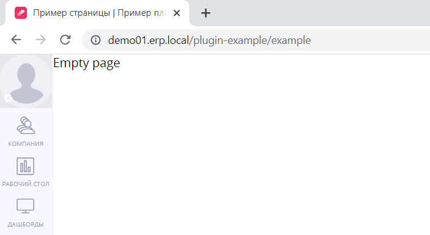

# Инструкция по созданию плагина

Данная инструкция поможет вам научиться создавать плагины в `Platrum`.

Для работы с плагинами вам потребуется:

* Знакомство со стандартом ECMAScript 2015
* Знание фреймворка [vue](https://vuejs.org/)
* базовое понимание формата [yml](https://ru.wikipedia.org/wiki/YAML)

После её прочтения вы:

* [Научитесь устанавливать плагины в проект](#установка)
* [Узнаете об устройстве плагинов](#общая-структура-плагина)
* [Создадите свой первый плагин](#создание-плагина)


## Установка

Управление плагинами осуществляется на странице настроек `/settings/page/plugins/list`.
Для доступа к этой странице в проекте вам необходимо обладать правами `Администрирование плагинов` (обратитесь к администратору проекта в случае отсутствия доступа).

Во время разработки плагина для проверки промежуточного результата работы неудобно каждый раз обращаться к веб-интерфейсу для загрузки текущей версии плагина.
Вместо интерфейса вы можете воспользоваться скриптом загрузки `upload.sh`, который располагается в корне этого репозитория.
Для работы скрипта вам потребуется установить следующие переменные окружения:

* `PLATRUM_API_KEY` - апи ключ вашего проекта
* `PLATRUM_API_PROJECT` - хост вашего проекта

После установки переменных окружения, вы можете вызвать скрипт, передавая ему имя вашего плагина первым параметром:

```
./upload.sh example
```

## Общая структура плагина

Плагин имеет простую структуру: он состоит из файлов конфигурации и файлов фронтенда, которые находятся в корневых папках `config` и `frontend` соответственно.
Далее мы рассмотрим подробнее [файлы конфигурации](#файлы-конфигурации) и узнаем о том, как устроен [frontend](#frontend)

### Файлы конфигурации

Для гибкой настройки разных аспектов вашего приложения, плагины используют файлы конфигурации. 
Давайте посмотрим на доступные:

* `main.yml` - [базовый файл конфигурации](#базовая-конфигурация) (обязательный)
* `routes.yml` - [определение маршрутов](#маршруты)
* `schema.yml` - [определение сущностей](#схема-данных)
* `access.yml` - [определение доступов](#доступы)
* `translations.yml` - [переводы](#переводы)

#### Базовая конфигурация

Для того чтобы ваш плагин заработал, необходимо добавить базовый файл конфигурации `config/main.yml`.
В этом файле определяются системное и человекочитамое имена плагина, краткое описание функциональности, а так же перечисляются зависимости от модулей `Platurm`:

```yml
#config/main.yml

module: plugin-example
name: Пример плагина
description: Описание плагина
dependencies:
  - ui
  - ui-collection
  - ui-element
  - company
```

Где:

* `module` - системное название плагина (наличие `plugin-` префикса **обязательно**)
* `name` - человекочитаемое имя плагина
* `description` - краткое описание функциональности плагина
* `dependencies` - перечисление зависимостей плагина от системных модулей `Platrum`

#### Маршруты

В файле `config/routes.yml` определяются маршруты вашего frontend приложения.
Без добавления маршрутов в этот файл страницы вашего приложения не будут доступны.
Маршруты добавляются очень просто:

```yml
#config/routes.yml

frontend:
  examplePage:
    pattern: /example
    title: Example page
  examplePage2:
    pattern: /example2
    title: Example page 2
```

Где:

* `frontend` - ключевое слово, объявляемые маршруты должны располагаться на уровень ниже, как в примере
* `examplePage` - id страницы, используемый для сопоставления пути и компонента страницы
* `pattern` - путь до страницы, отображаемый в адресной строке браузера
* `title` - заголовок страницы, отображаемый во вкладке браузера

#### Схема данных

Для работы с данными вам необходимо описать сущность, с которой вы собираетесь работать, в файле `config/schema.yml`.
Возможности для манипулирования данными мы рассмотрим позднее.
Ниже приведен добавления сущности `example_item` с набором полей `fields`:

```yml
# config/schema.yml

example_item:
  fields:
    user_id:
      type: string
    text:
      type: string
    date:
      type: date
    string_field:
      type: string
    bool_field:
      type: bool
    int_field:
      type: int
    int_array:
      type: array[int]
    map_field:
      type: map
```

Доступные типы полей:

* `int` - целочисленное значение
* `string` - строковое значение
* `bool` - булево значение
* `array` - массив значений, может быть типизированным, например `array[int]`
* `map` - коллекция ключ/значение
* `date` - дата в `ISO` формате

#### Доступы

Платформа позволяет определять пользовательские доступы.
Для работы с доступами вам потребуется описать их в файле `config/access.yml`:
Пример добавления доступа:

```yml
# config/access.yml

user_creation:
  name: Создание пользователей
user_deletion:
  name: Удаление пользователей
```

Где:

* `user_creation` - системное название доступа, которому вы будете обращаться при проверке доступа
* `Создание пользователей` - человекочитаемое название доступа

После объявления доступа, он появится на странице доступов `/settings/page/common/access`.

#### Переводы

Платформа позволяет быть вашему плагину мультиязычным. Переводы хранятся в файле `config/translations.yml`.
Также в этом файле объявляется имя вашего плагина, доступное пользователям.
Пример:

```yml
#config/translation.yml
ru:
  module.name: Пример плагина
en:
  module.name: Plugin example
  Выберите пользователя: Select user
  Заполните дату: Fill in the date
```

Где:

* `ru`, `en` - коды языков, на данный момент пользователю доступно три языка: `ru`, `en`, `cn`
* `module.name` - имя вашего плагина
* `Выберите пользователя: Select user` - фраза и её перевод

Использование переводов будет рассмотрено в следующей главе.

### Frontend

Для разработки frontend'а используется фреймворк `vue` версии `2.5.16`. 
Так же вам доступна библиотека компонентов [element](https://element.eleme.io/2.9/#/en-US) версии `2.9`

#### app.js

@TODO 

#### pages.js

@TODO

## Создание плагина

В данном разделе мы пошагово создадим с вами базовый плагин, который вы сможете использовать для дальнейшей разработки под собственные нужды.
Что мы сделаем в рамках данного руководства:

* Добавим пустую страницу в меню `компании`
* Оживим страницу, добавив в неё верстку
* Узнаем, как манипулировать данными
* Научимся управлять доступами

### Добавление пустой страницы в меню `компании`

На данном шаге мы создадим хоть и пустую, но работающую страницу в проекте. 
Для добавления страницы в меню `компании` нам нужно:

* создать `vue` компонент страницы
* экспортировать страницу в `frontend/pages.js`
* объявить маршрут в `config/routes.yml`
* добавить имя модуля в `config/translactions.yml`
* добавить созданную страницу в меню модуля `компании`

#### Создание компонента страницы

Создадим пока что пустую страницу в папке `frontend/pages/examplePage/index.vue`.
При разработке плагина вы можете придерживаться любой удобной вам структуры файлов, единственное ограничение - все ваши компоненты должны находится в корневой папке плагина `frontend`.

```vue
<!--frontend/pages/examplePage/index.vue-->

<template>
  <div>Empty page</div>
</template>
```

#### Экспортируем страницу

```js
// frontend/pages.js

import examplePage from './pages/examplePage';

export default {
  examplePage,
};
```

#### Добавляем маршрут страницы

```yaml
# config/routes.yml

frontend:
  examplePage:
    pattern: /example
    title: Пример страницы
```

#### Добавляем название плагина

Название модуля, находящееся в `config/translations.yml`, используется для 

#### Добавление страницы в меню модуля

Модули платформы, например модуль `компании`, поддерживают добавление страниц плагинов в своё меню.
Чтобы добавить страницу в меню модуля, нам потребуется объявить свойство `slots` экспортируемый по умолчанию объект в `frontend/app.js`

```js
// frontend/app.js

export default {
  slots: {
    'company.header': [
      {
        name: 'Пример страницы',
        route: 'plugin-example.examplePage',
      },
    ],
  },
};
```

Где:

* `company.header` - название слота меню
* `name` - заголовок вкладки меню
* `route` - id маршрута страницы, который мы добавили ранее. Обратите внимание на то, что к id маршрута нужно добавлять имя вашего модуля, указанное в `config/main.yml` в ключе `module`.  

#### Результат

Загружаем наш промежуточный результат, используя скрипт `upload.sh`:

```bash
./upload.sh example
```

В следующих разделах не будет упоминаться использование команды выше, но имейте в виду - для того, чтобы ваши изменения применились, вам необходимо повторно загружать код плагина.  

<p align="center">
  
</p>

### Добавление маршрутов

Пример объявления роута `examplePage` с путем `/example` и заголовком `Example page`:

```yml
frontend:
  examplePage:
    pattern: /example
    title: Example page
```

### Экспорт страницы

Пример экспорта страницы `examplePage` в `frontend/pages.js`:

```js
import examplePage from './pages/examplePage';

export default {
  examplePage,
};
```


### Сохранение

Для сохранения одной или нескольких сущностей вы можете использовать методы `storeOne` или `storeMany` соответственно.

Примеры:

```js
/**
 * @param {object} item
 * @return {Promise<object>}
 */
async function storeItem(item) {
  return await this.$modules.plugins.api.storeOne('plugin-example.example_item', item);
}

/**
 * @param {object[]} items
 * @return {Promise<object[]>}
 */
async function storeItems(items) {
  return await this.$modules.plugins.api.storeMany('plugin-example.example_item', items);
}
```

### Загрузка

Для получения ранее сохраненных данных используйте метод `select`.
Пример:

```js
/**
 * @param {array} filter
 * @return {Promise<object[]>}
 */
async function loadItems(filter) {
  return await this.$modules.plugins.api.select('plugin-example.example_item', filter);
}
```

### Удаление

Для удаления данных вы можете использовать метод `delete`.
Пример:

```js
/**
 * @param {object} item
 * @return {Promise<void>}
 */
async function deleteItem(item) {
  await this.$modules.plugins.api.delete('plugin-example.example_item', [
    ['id', '=', item.id],
  ]);
}
```

### Фильтры

Методы `select` и `delete` поддерживают работу с фильтрами.
Фильтр это массив, состоящий из трех частей: имени поля, оператора и значения:
`['field_name', 'operator', 'value']`, где:

* `field_name` - имя поля, описанное в `config/schema.yml` в массиве `fields`
* `operator` - оператор, используемый при фильтрации. Поддерживаемые значения: `=`, `>`, `>=`, `<`, `<=`, `in`, `not_in`
* `value` - искомое значение поля

Фильтры могут объединяться в массив, образуя `and` условие:

```js
this.$modules.plugins.api.select('plugin-example.example_item', [
  ['user_id', 'in', ['userId1', 'userId2']],
  ['date', '>=', '2021-08-15T21:00:00Z'],
  ['date', '<=', '2021-08-16T20:59:59Z'],
  ['int_field', '=', 100],
]);
```

Если вам требуется найти данные, которые подходят хотя бы под один фильтр, вы можете воспользоваться `or` оператором:

```js
this.$modules.plugins.api.select('plugin-example.example_item', [
  {
      or: [
        ['user_id', 'in', ['userId1', 'userId2']],
        ['int_field', '=', 100],
      ],
  },
]);
```

## Работа с правами пользователей

### Добавление доступа

Для создания доступа объявите доступ в файле конфигурации `config/access.yml`:

```yml
user_creation:
  name: Создание пользователей
```

После объявления доступа, он появится на странице доступов `/settings/page/common/access`.
[Подробнее](https://help.platrum.ru/article/45-article) о доступах.

### Проверка доступа

Пример функции проверки доступов:
```js
/**
 * @returns {bool}
 */
function hasCreationAccess() {
  return this.$platform.access.hasAccess('plugin-example.user_creation');
}
```

### Настройка доступов к сущностям

#### Общая структура доступа

```js
const permission = {
  action: 'view',
  block_id: 1,
  user_id: null,
  allow_nested: null,
  allow_everyone: null,
  allow_managers: null,
}
```
где:

* `action` - название действия (может быть любым)
* `block_id` - ID должности
* `user_id` - ID пользователя
* `allow_nested` - доступ для подчиненных
* `allow_everyone` - доступ для всех пользователей 
* `allow_managers` - доступ для руководителей

#### Примеры

* Доступ на чтение для пользователей с должностью c ID = `2`

```json
{
    "action": "read",
    "block_id": 2
}
```

* Доступ на редактирование пользователю с ID = `1a8642fa90a52d5103c114f5b1a30aae`

```json
{
  "action": "edit",
  "user_id": "1a8642fa90a52d5103c114f5b1a30aae"
}
```

* Доступ на чтение для всех пользователей

```json
{
  "action": "read",
  "allow_everyone": true
}
```

* Доступ на чтение для всех руководителей пользователя с ID = `1a8642fa90a52d5103c114f5b1a30aae`

```json
{
  "action": "read",
  "user_id": "1a8642fa90a52d5103c114f5b1a30aae",
  "allow_managers": true
}
```

* Доступ на редактирование для должности с ID = `2` и для всех подчиненных этой должности 

```json
{
  "action": "read",
  "block_id": 2,
  "allow_nested": true
}
```

## Работа с переводами

@TODO